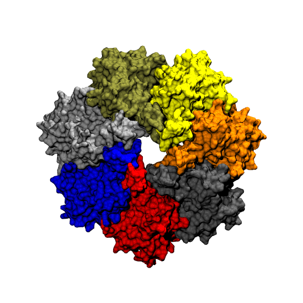
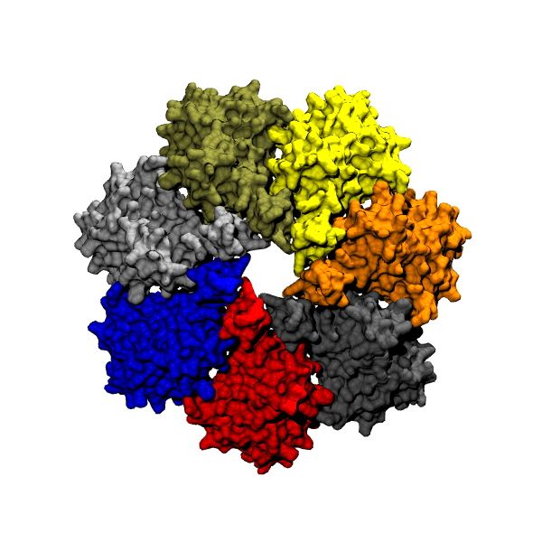

# sym-avrg
Calculate symmetrical average coordinate after rotation along an axis.

Input structure:

Averaged structure after 7 rotations:

*Reference*

Zhu, Fangqiang, and Gerhard Hummer. "Pore opening and closing of a pentameric ligand-gated ion channel." Proceedings of the National Academy of Sciences 107.46 (2010): 19814-19819.
